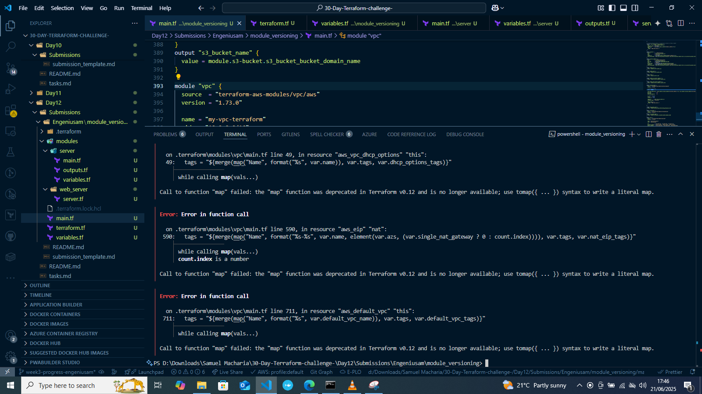

# Day 11 Submission

## Personal Information
- **Name:** Samuel Macharia
- **Date:** 21/06/2025
- **GitHub Username:** Engeniusam

## Task Completion
- [✔] Read Chapter 5 (Pages 169-189) of "Terraform: Up & Running"
- [✔] Completed Required Hands-on Labs
- [✔] Twitter Post

## Social Media
- **Platform:** Twitter
- **Post Link:** https://x.com/engeniusam/status/1936423097680462251

## Notes and Observations
  - I have learnt that using terraform validate errors surface if there are older versions of resources in module.

## Additional Resources Used
GitHub Copilot
Terraform Documentation

## Time Spent
- Reading: [42 minutes]
- Infrastructure Deployment: [30 hour]
- Total: [1 hour 12 mins]

## Repository Structure
```
# 📁 Day12
└── 📁 Submissions
    └── 📁 Engeniusam
        └── 📁 module_versioning
            ├── 📁 .terraform
            ├── 📁 modules
            ├── 📄 .gitignore
            ├── 📄 .terraform.lock.hcl
            ├── 📄 main.tf
            ├── 📄 terraform.tf
            ├── 📄 variables.tf
            ├── 🖼️ image.png
        └── 📄 submission_day12.md

```


