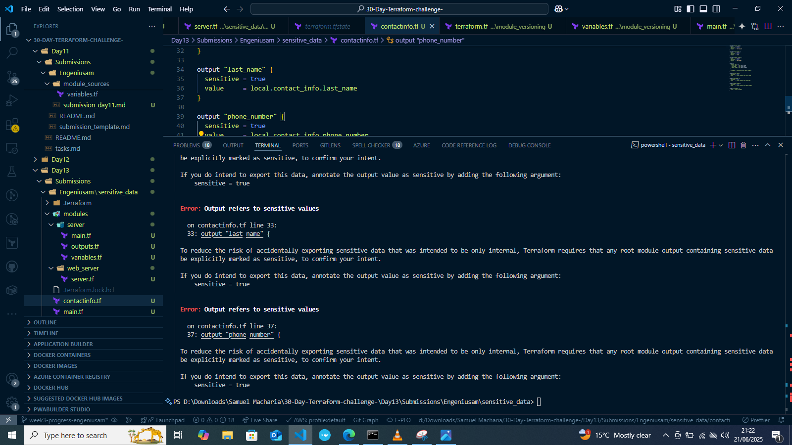
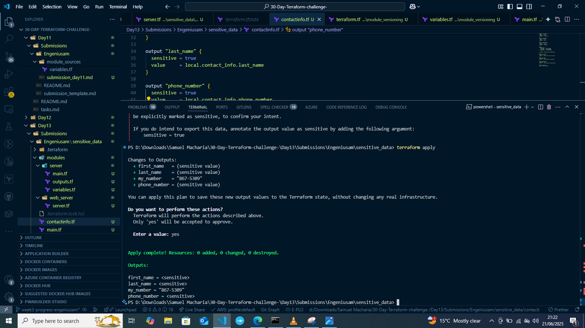

# Day 11 Submission

## Personal Information
- **Name:** Samuel Macharia
- **Date:** 21/06/2025
- **GitHub Username:** Engeniusam

## Task Completion
- [✔] Read Chapter 6 (Pages 219-221) of "Terraform: Up & Running"
- [✔] Completed Required Hands-on Labs
- [✔] Blog Post
- [✔] Twitter Post

## Blog Post
- **Title:** How to Handle Sensitive Data Securely in Terraform
- **Link:** https://medium.com/@engeniusam/how-to-handle-sensitive-data-securely-in-terraform-c5c3ed55a19d

## Social Media
- **Platform:** Twitter
- **Post Link:** https://x.com/engeniusam/status/1936441605457658108

## Notes and Observations
- I have learnt how terraform detects sensitive data in state file.
  
- Marking sensitive data as true in the output secures sensitive data
 

## Additional Resources Used
GitHub Copilot
Terraform Documentation

## Time Spent
- Reading: [1 hour]
- Infrastructure Deployment: [1 hour]
- Total: [2 hours]

## Repository Structure
```
Day13/
├── Submissions/
│   └── Engeniusam/
│       └── sensitive_data/
│           ├── .terraform/
│           ├── modules/
│           │   ├── server/
│           │   │   ├── main.tf
│           │   │   ├── outputs.tf
│           │   │   └── variables.tf
│           │   │
│           │   └── web_server/
│           │       └── server.tf
│           │
│           ├── .terraform.lock.hcl
│           ├── image-1.png
│           ├── image-2.png
│           ├── image.png
│           ├── main.tf
│           ├── submission_day13.md
│           └── terraform.tf

```


