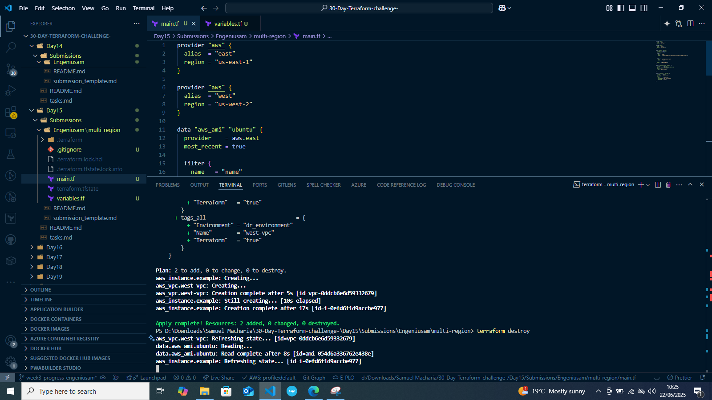

# Day 15 Submission

## Personal Information
- **Name:** Samuel Macharia
- **Date:** 22/06/2025
- **GitHub Username:** Engeniusam

## Task Completion
- [✔] Read Chapter 7 of "Terraform: Up & Running"
- [✔] Completed Required Hands-on Labs
- [✔] Twitter Post

## Social Media
- **Platform:** Twitter
- **Post Link:** https://x.com/engeniusam/status/1936503137574994396

## Notes and Observations
- I have learnt to procure AWS resources from different regions using the alias provider.



## Additional Resources Used
Terraform Documentation
Gemini Code Assist

## Time Spent
- Reading: [1 hour]
- Infrastructure Deployment: [30 minutes]
- Total: [1 hour 30 mins]

## Repository Structure
```
Day15/
└── Submissions/
    └── Engeniusam/
        └── multi-region/
            ├── .terraform/
            ├── .gitignore
            ├── .terraform.lock.hcl
            ├── image.png
            ├── main.tf
            ├── submission_day15.md
            ├── terraform.tfstate
            ├── terraform.tfstate.backup
            └── variables.tf

```


