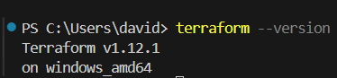
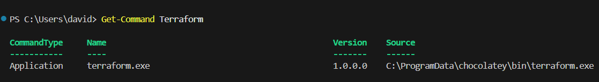
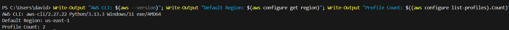

# Day 2 Submission

## Personal Information
- **Name:** David Washington Kamau Kibe
- **Date:** 27th May 2025
- **GitHub Username:** David-Kamau-Builds

## Task Completion
- [x] Read Chapter 2 of "Terraform: Up & Running" (Setting Up Your AWS Account & Installing Terraform)
- [x] Completed Required Hands-on Labs
- [x] Lab 01: Setup your AWS Account (if needed)
- [x] Lab 02: Install AWS CLI
- [x] Lab 03: Installing Terraform and set up Terraform with AWS
- [x] Set up AWS account
- [x] Install Terraform locally
- [x] Install and configure AWS CLI
- [x] Install Visual Studio Code (VSCode) and add the AWS plugin
- [x] Configure VSCode to work with AWS

## Setup Validation

### Terraform Installation
- **Version:** 
- **Installation Method:** I installed Terraform through Chocolatey. Method is in my blog post 👉[Step-by-Step Guide to Setting Up Terraform, AWS CLI, and Your AWS Environment](https://medium.com/@davidwashingtonkamau/step-by-step-guide-to-setting-up-terraform-aws-cli-and-your-aws-environment-79b08136fb78)
- **Path:** 

### AWS CLI Configuration
- **Version:** 2.27.22
- **Default Region:** us-east-1
- **Profile Configuration:** 2


### VSCode Configuration
- **Extensions Installed:**
    - AWS Toolkit
    - HashiCorp Terraform
    - Azure Terraform
- **AWS Plugin Status:** [Configured]

## Configuration Files
Please place your configuration screenshots and validation files in the `setup-validation` folder:
- `terraform-version.txt` - Output of `terraform version`
- `aws-config-validation.txt` - Output of `aws sts get-caller-identity` (sanitized)

## Blog Post
- **Title:** Step-by-Step Guide to Setting Up Terraform, AWS CLI, and Your AWS Environment.
- **Link:** https://medium.com/@davidwashingtonkamau/step-by-step-guide-to-setting-up-terraform-aws-cli-and-your-aws-environment-79b08136fb78

## Social Media
- **Platform:** LinkedIn
- **Post Link:** https://www.linkedin.com/posts/davidwashingtonkamau_terraform-aws-devops-activity-7333192321481531392-OR3t?utm_source=share&utm_medium=member_desktop&rcm=ACoAAE7Yhn0B4r6JF1eNqzo97b9jvzabJQMz9Z8

## Notes and Observations
[Share your key learnings, challenges faced, and how you overcame them during the setup process]

## Additional Resources Used
[List any additional resources you found helpful for setup and configuration]

## Time Spent
- Reading: [1 hours]
- AWS Account Setup: [1 hours]
- Terraform Installation: [10 minutes]
- AWS CLI Configuration: [20 minutes]
- VSCode Setup: [0.5 hours]
- Blog Writing: [1 hour]
- Total: [4 hours]

## Repository Structure
```
Day2/
└── Submissions/
    └── David-Kamau-Builds/
        ├── setup-validation/
        │   ├── terraform-version.png
        │   ├── aws-config-validation.png
        ├── daily-update.md
        └── day2-submission.md
```

## Setup Validation Commands
Document the commands you used to validate your setup:

```bash
# Terraform validation
terraform version
terraform providers

# AWS CLI validation  
aws --version
aws sts get-caller-identity
aws configure list

# VSCode validation
code --version
code --list-extensions | grep -E "(aws|terraform)"
```

## Troubleshooting Notes
Terraform’s PATH issues were resolved by opting to use Chocolatey and let it place the binary in the right location automatically.