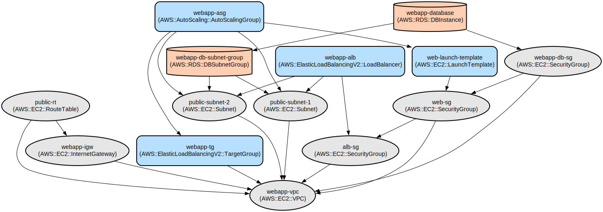

# Automated Web Application Deployment with AWS Infrastructure and CI/CD Pipeline

This project implements a scalable web application deployment solution that combines infrastructure as code using Terraform with automated CI/CD pipelines using GitHub Actions. The solution provides a highly available web application hosted on AWS with automated testing, infrastructure validation, and deployment processes.

The project features a Node.js Express application deployed on AWS infrastructure using an Auto Scaling Group behind an Application Load Balancer. The infrastructure is defined using Terraform and managed through Terraform Cloud, while the deployment process is automated using GitHub Actions workflows. The solution includes comprehensive security configurations, monitoring capabilities, and follows infrastructure as code best practices.

## Repository Structure

```
Work-flow/
├── application/                 # Node.js Express application files
│   ├── package.json            # Node.js project configuration and dependencies
│   ├── server.js               # Express server implementation
│   └── server.test.js          # Application test suite
├── terraform/                   # Infrastructure as Code definitions
│   ├── main.tf                 # Primary AWS infrastructure configuration
│   ├── terraform-cloud.tf      # Terraform Cloud and RDS configuration
│   ├── variables.tf            # Infrastructure variable definitions
│   ├── outputs.tf              # Infrastructure output definitions
│   ├── provider.tf             # AWS provider configuration
│   └── versions.tf             # Terraform version constraints
└── .github/workflows/          # CI/CD pipeline definitions
    └── deploy.yml              # GitHub Actions workflow configuration
```

## Usage Instructions

### Prerequisites

- AWS Account with appropriate permissions
- Terraform Cloud account
- GitHub account
- Node.js 18.x or later
- AWS CLI configured with appropriate credentials
- Terraform CLI installed (version >= 1.0)

### Installation

#### Application Setup

```bash
# Clone the repository
git clone <repository-url>
cd Work-flow/application

# Install dependencies
npm install

# Run tests
npm test

# Start the application locally
npm start
```

#### Infrastructure Setup

```bash
# Navigate to terraform directory
cd ../terraform

# Initialize Terraform
terraform init

# Validate Terraform configuration
terraform validate

# Plan infrastructure changes
terraform plan

# Apply infrastructure changes
terraform apply
```

### Quick Start

1. Fork and clone the repository
2. Configure Terraform Cloud credentials:
   ```bash
   export TF_API_TOKEN=<your-terraform-cloud-token>
   ```
3. Configure GitHub repository secrets:
   - Add `TF_API_TOKEN` secret with your Terraform Cloud API token
4. Push changes to the main branch to trigger the deployment workflow

### More Detailed Examples

#### Running the Application in Development Mode

```bash
cd application
npm run dev
```

#### Testing the Application

```bash
# Run tests with coverage
npm test

# Access the application endpoints
curl http://localhost:3000/
curl http://localhost:3000/health
```

### Troubleshooting

#### Common Issues

1. Terraform Cloud Authentication

   - Error: `Error: No valid credential sources found`
   - Solution: Ensure `TF_API_TOKEN` is properly set and has correct permissions

2. Application Deployment

   - Error: `Error: timeout waiting for ALB target group to be healthy`
   - Solution:
     ```bash
     # Check instance health
     aws elbv2 describe-target-health --target-group-arn <target-group-arn>
     ```

3. Infrastructure Debug Mode
   ```bash
   # Enable Terraform logging
   export TF_LOG=DEBUG
   export TF_LOG_PATH=./terraform.log
   ```

## Data Flow

The application implements a simple web service with health monitoring capabilities, deployed on AWS infrastructure with auto-scaling capabilities.

```ascii
                                     ┌──────────────┐
                                     │  GitHub      │
                                     │  Actions     │
                                     └───────┬──────┘
                                             │
                                             ▼
┌──────────┐    ┌─────────┐    ┌────────────────────┐    ┌─────────────┐
│  Client  │───►│   ALB   │───►│  Auto Scaling      │───►│  Express.js │
│ Requests │    │         │    │  Group (EC2)       │    │  Application│
└──────────┘    └─────────┘    └────────────────────┘    └─────────────┘
                                             │
                                             ▼
                                     ┌──────────────┐
                                     │    RDS       │
                                     │  Database    │
                                     └──────────────┘
```

Key Component Interactions:

1. GitHub Actions triggers deployment on push to main branch
2. Terraform Cloud manages infrastructure state and sensitive variables
3. ALB distributes traffic across multiple EC2 instances
4. Auto Scaling Group maintains desired instance count
5. EC2 instances run the Express.js application
6. RDS provides persistent data storage
7. Security groups control access between components

## Infrastructure



### VPC Resources

- VPC: `aws_vpc.main` (CIDR: 10.0.0.0/16)
- Public Subnets: 2 subnets in different AZs
- Internet Gateway: For public internet access
- Route Tables: For public subnet routing

### Compute Resources

- Auto Scaling Group: 2-4 instances
- Launch Template: Amazon Linux 2 AMI
- Application Load Balancer: HTTP listener on port 80

### Database Resources

- RDS Instance: MySQL 8.0
- DB Subnet Group: Across multiple AZs
- Security Group: Restricted access from web tier

### Security Groups

- ALB Security Group: Allows inbound HTTP
- Web Security Group: Allows traffic from ALB
- DB Security Group: Allows MySQL from web tier

## Deployment

### Prerequisites

1. Configure GitHub repository secrets:
   - `TF_API_TOKEN`

### Deployment Steps

1. Push to main branch triggers GitHub Actions workflow
2. Workflow runs tests and validates infrastructure
3. On success, deploys infrastructure changes
4. Auto Scaling Group launches instances
5. Application becomes available via ALB DNS name# day21_test

# day21_test
