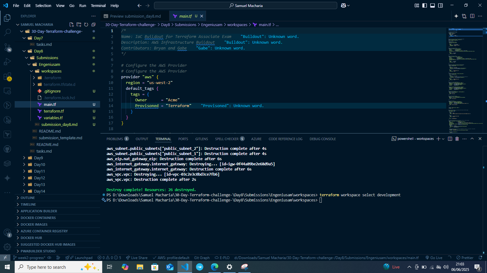

# Day 8 Submission

## Personal Information
- **Name:** Samuel Macharia
- **Date:** 06/06/2025 21:04 PM
- **GitHub Username:** Engeniusam

## Task Completion
- [✔] Read Chapter 4 of "Terraform: Up & Running"
- [✔] Completed Required Hands-on Labs
- 


## Blog Post
- **Title:** [Your Blog Post Title]
- **Link:** [URL to your blog post]

## Social Media
- **Platform:** Twitter
- **Post Link:** https://x.com/engeniusam/status/1930492225269420538

## Notes and Observations


## Additional Resources Used
"Terraform: Up & Running" by Yevgeniy Brikman
GitHub Copilot & Gemini Code Assist

## Time Spent
- Reading: [2 hours]
- Infrastructure Deployment: [1 hour]
- Blog Writing: [40 mins]
- Total: [3 hours 40 mins]

## Repository Structure
```
Day8/
└── Submissions/
    └── Engeniusam/
        └── workspaces/
            ├── .terraform/
            ├
            ├── .gitignore
            ├
            ├── main.tf
            ├── terraform.tf
            ├── variables.tf
            └── submission_day8.md

```


